 

 

## About

- B.S. Data Science, Air University, Islamabad, Pakistan
- Machine Learning Engineer focused on RAG pipelines, GenAI systems, and MLOps
- Built 4+ end-to-end ML/GenAI systems, from data ingestion to cloud deployment
- Models delivering 94%+ F1-score and 0.97 R² score on real-world data
- Currently sharpening skills in LLM fine-tuning and production-grade AI systems

 

## Technical Stack

 

 

## Featured Projects

<i>More projects: <a href="https://github.com/Abdullah-qazi-1?tab=repositories">github.com/Abdullah-qazi-1</a></i>

 

## GitHub Stats

 

## Contact

abdullahizaq321@gmail.com &nbsp;|&nbsp; <a href="https://www.linkedin.com/in/abdullah1datascientist/">LinkedIn</a> &nbsp;|&nbsp; Islamabad, Pakistan

